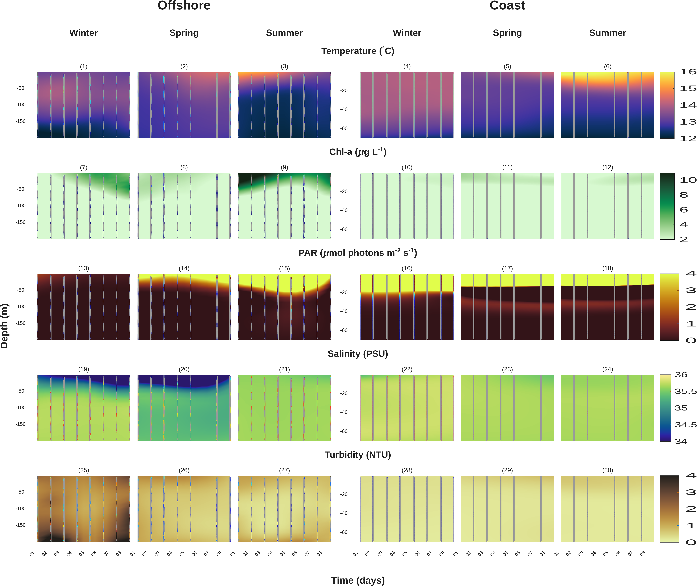
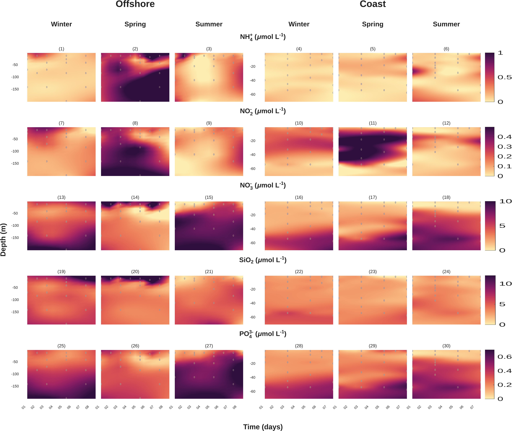
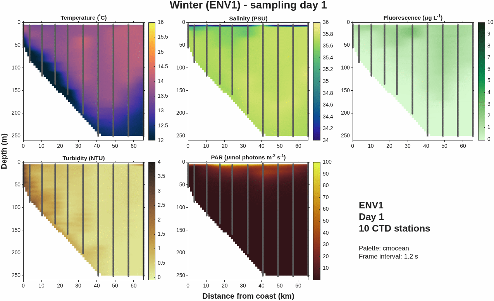

# Coastal upwelling systems (oceanography)


MATLAB workflows and oceanographic datasets associated with the study  
**“Coastal upwelling systems as dynamic mosaics of bacterioplankton functional specialization.”**

This repository contains the physical and biogeochemical oceanography component of the study. The metatranscriptomic and microbial analyses are maintained separately in [`coastal-upwelling-metat`](https://github.com/erickdelgadillo/coastal-upwelling-metat).

## Scientific scope

- CTD profiles for coastal and offshore stations
- Nutrient and chlorophyll-a profiles
- Seasonal temporal comparisons
- Longitudinal ENV1–ENV3 transects
- Daily CTD transect evolution
- Interpolation and oceanographic visualization in MATLAB

## Representative outputs

The repository includes reproducible visualizations of the physical and biogeochemical structure of the coastal upwelling system.

### Seasonal vertical profiles



*Seasonal temperature, chlorophyll-a, PAR, salinity, and turbidity profiles for the offshore and coastal stations.*



*Seasonal ammonium, nitrite, nitrate, silicate, and phosphate profiles for the offshore and coastal stations.*

### Daily longitudinal CTD evolution

<p align="center">
  
</p>

<p align="center">
  <em>Daily evolution of temperature, salinity, fluorescence, turbidity, and PAR along the coastal–offshore transect using cmocean palettes.</em>
</p>

The equivalent animation using the original `jet` colour scale is available [here](figures/longitudinal/animations/longitudinal_ctd_daily_original.gif).

Static winter, spring, and summer longitudinal sections are available under [`figures/longitudinal/`](figures/longitudinal/).

## Published workflow

The final article material was compared with the historical ENVISION working directory to identify the scripts and workbooks used for the published CTD and nutrient panels.

| Published figure | Content | Live scripts | Input workbooks |
| --- | --- | --- | --- |
| Supplementary Figure 1 | Temperature, fluorescence-derived chlorophyll-a, PAR, salinity, and turbidity profiles | `station3_ctd.mlx`, `station6_ctd.mlx` | `S3_CTD.xlsx`, `S6_CTD.xlsx` |
| Supplementary Figure 2 | Ammonium, nitrite, nitrate, silicate, and phosphate profiles | `station3_nutrients.mlx`, `station6_nutrients.mlx` | `S3_Metadata.xlsx`, `S6_Metadata.xlsx` |

Station 3 is the offshore station and Station 6 is the coastal station. The four publication workbooks are under `data/temporal/`. Their checksums and the detailed figure mapping are documented in [`live_scripts/temporal/README.md`](live_scripts/temporal/README.md).

The other scripts and workbooks are retained as additional historical or exploratory analyses and are not claimed to reproduce published figures.

## Assemble the publication matrices

The four publication Live Scripts were executed interactively with MATLAB R2026a on 13 September 2026 and generated 72 seasonal panel files. After those scripts finish, assemble the two 5 × 6 compositions in both the original and cmocean colour variants from the generated PNG files:

```matlab
addpath(fullfile(pwd, 'scripts', 'figures'));
assemble_supplementary_figures;
```

The assembler selects the 60 panels used by the article and writes two compositions with the original article colour scale plus two perceptually uniform cmocean alternatives.

Rows represent variables. Columns show winter, spring, and summer at the offshore station followed by the same seasons at the coastal station.

See [`figures/README.md`](figures/README.md) for the complete mapping, output names, and cmocean palette assignments.

## Generate longitudinal sections

The six historical ENV1–ENV3 Live Scripts are preserved under `live_scripts/longitudinal/`.

A restored generator reads the curated workbooks by column name and corrects obsolete row counts and station copy-and-paste errors without changing the historical linear interpolation method:

```matlab
addpath(fullfile(pwd, 'scripts', 'longitudinal'));
generate_longitudinal_sections;
```

It generates the winter, spring, and summer vertical-section panels with both the original `jet` scale and variable-specific cmocean alternatives under:

```text
figures/longitudinal/original/
figures/longitudinal/cmocean/
```

See [`live_scripts/longitudinal/README.md`](live_scripts/longitudinal/README.md) for the audit findings and data mapping.

The longitudinal generators convert the source longitude and latitude to great-circle distance from the coastal end of the transect. The horizontal axis therefore preserves the measured, non-uniform spacing between profiles.

The CTD transect extends approximately 65.6 km from the coast toward the offshore station, with distance calculated from the geographic coordinates recorded in the source CTD and nutrient tables.

## Animate the daily CTD transects

The static longitudinal sections are single-day snapshots rather than seasonal averages.

Additional daily CTD transects recovered from the local ENVISION archive can be animated with:

```matlab
addpath(fullfile(pwd, 'scripts', 'longitudinal'));
generate_longitudinal_ctd_animation;
```

The function creates 16-frame `jet` and cmocean GIF animations under:

```text
figures/longitudinal/animations/
```

Each frame contains:

- temperature
- salinity
- fluorescence
- turbidity
- PAR

with fixed colour limits across frames to preserve comparability through time.

Nutrients are not animated because only day-1 longitudinal nutrient observations are available.

The representative GIFs are tracked in the repository for visualization in the README and can be regenerated reproducibly from the underlying CTD data using the MATLAB workflow above.

## Run

Start MATLAB in the repository root:

```matlab
repoRoot = pwd;
paths = coastal_setup('temporal');
open(fullfile(paths.repo_root, 'live_scripts', 'temporal', 'station3_ctd.mlx'));
```

Open and run the desired Live Script.

`coastal_setup` adds the bundled third-party utilities and changes MATLAB's working folder to the matching data directory, preserving the historical relative input paths.

Available workflow names are:

```text
temporal
longitudinal
exploratory
figures
```

To store the input data elsewhere, set `COASTAL_UPWELLING_OCEANOGRAPHY_DATA_DIR` to a directory with the same layout.

## Repository structure

```text
coastal-upwelling-oceanography/
├── data/
│   ├── temporal/              # Published and exploratory temporal inputs
│   ├── longitudinal/          # ENV1–ENV3 transect inputs
│   ├── exploratory/           # General temporal metadata
│   └── figures/               # Inputs for plain MATLAB figure scripts
│
├── live_scripts/
│   ├── temporal/              # Published temporal profile scripts
│   └── longitudinal/          # Historical transect analyses
│
├── figures/
│   ├── supplementary_figure_1.png
│   ├── supplementary_figure_2.png
│   ├── supplementary_figure_1_cmocean.png
│   ├── supplementary_figure_2_cmocean.png
│   │
│   └── longitudinal/
│       ├── original/          # Static sections using historical jet scale
│       ├── cmocean/           # Static sections using oceanographic palettes
│       └── animations/        # Daily longitudinal CTD GIFs
│
├── scripts/
│   ├── figures/               # Publication matrix assembler
│   ├── longitudinal/          # Longitudinal generators and animations
│   └── exploratory/           # Exploratory analyses
│
├── third_party/               # External MATLAB utilities and notices
├── coastal_setup.m            # Workflow and data-path setup
├── DATA.md                    # Data provenance and inventory
└── README.md
```

## Data provenance

The 15 workbooks were transferred without modification from the curated local data archive previously used by `coastal-upwelling-metat`.

The files total approximately 31 MB and are included so the MATLAB workflows do not depend on a separate private directory.

See [`DATA.md`](DATA.md) and [`data/SHA256SUMS`](data/SHA256SUMS) for the complete inventory and checksums.

The inspected workbooks contain oceanographic observations and no personal contact information.

## Requirements and validation

The workflows use MATLAB functions including `xlsread` and `exportgraphics`.

The following third-party utilities are bundled under `third_party/` with their original attribution and notices:

- `gridfit`
- `brewermap`
- `brewermap_view`
- `cmocean`

The selected publication Live Scripts match their historical counterparts byte for byte. Their input names and output panels were matched to the final supplementary figures.

The workbooks pass ZIP-container integrity checks.

The four publication Live Scripts were run interactively with MATLAB R2026a on 13 September 2026 and produced all 72 expected PNG panels.

Every output was checked as a valid PNG, and representative panels from both stations, all three seasons, and both workflows were reviewed visually.

Automated batch execution from the migration environment remained unavailable because MATLAB Service Host returned licensing error 5201; this did not affect the interactive run.

The historical exploratory script `oceanographic_exploration.m` references an unavailable `nutrients_remedios_cruise.mat` file.

The previously external `cmocean` dependency is now bundled, but the missing data file still prevents that exploratory workflow from running in full.

This limitation does not affect the four publication Live Scripts or the restored longitudinal workflows.

## Associated publications

- Delgadillo-Nuño et al. (2024), *Frontiers in Marine Science*  
  https://doi.org/10.3389/fmars.2023.1259783

- Correction (2026), *Frontiers in Marine Science*  
  https://doi.org/10.3389/fmars.2026.1886620

The 2026 correction replaces Supplementary Figures 3 and 5.

The MATLAB workflows in this repository correspond to Supplementary Figures 1 and 2 and are not identified as affected by that correction.

## Author

**Erick Delgadillo-Nuño**

Marine microbial ecology · Oceanography · MATLAB · Reproducible scientific workflows
